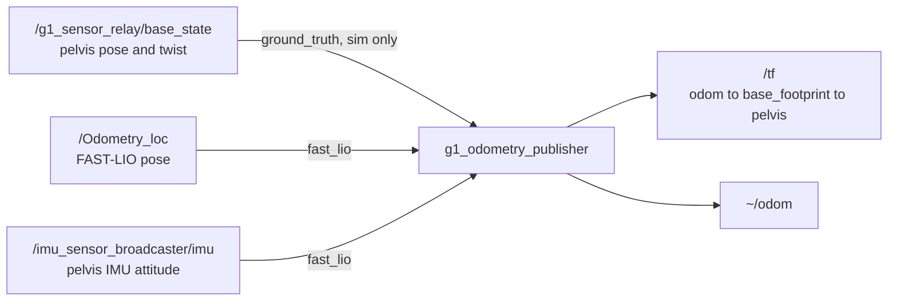

# g1_state_estimation

Publishes `odom -> base_footprint -> pelvis` and `nav_msgs/Odometry` for the G1: from FAST-LIO2 on
the robot and in simulation, or from MuJoCo ground truth in simulation. Also ships
`g1_livox_pointcloud`, the hardware Livox CustomMsg to PointCloud2 converter.

`ament_cmake`, C++20. One lifecycle node, `g1_odometry_publisher`, plus `g1_livox_pointcloud`.
`scripts/lio_bench` is Python because it is offline tooling that no launch file starts.


```mermaid
flowchart LR
    SM["/g1_sensor_relay/base_state<br/>pelvis pose and twist"] -- "ground_truth, sim only" --> N
    LO["/Odometry_loc<br/>FAST-LIO pose"] -- fast_lio --> N
    LS["/imu_sensor_broadcaster/imu<br/>pelvis IMU attitude"] -- fast_lio --> N
    N["g1_odometry_publisher"] --> TF["/tf<br/>odom to base_footprint to pelvis"]
    N --> OD["~/odom"]
```

## Odometry source

The real G1 publishes no odometry: its sport-mode state carries only `fsm_id`, `fsm_mode`,
`task_id` and `task_time`. The robot's odometry is LiDAR-inertial: FAST-LIO2 (package `fast_lio`,
from the `fast_lio_humanoid` submodule), fed by the Mid360 and its built-in IMU.

| `odometry_source` | Behaviour |
|---|---|
| `ground_truth` | Simulation only. Exact pelvis pose and twist from MuJoCo, via `g1_sensor_relay`'s `~/base_state`. No drift, noise or latency. |
| `fast_lio` | FAST-LIO's pose re-referenced into `odom`, with a differenced twist because FAST-LIO leaves it empty. Drifts; `map -> odom` corrects it. Robot and simulation. |
| `hardware` (node default) | Refuses to configure, which shows as a failed lifecycle transition, and points at `fast_lio`, so a misconfigured bring-up cannot publish fabricated odometry. |

`bringup.launch.py` and `sim.launch.py` take `odometry:=fast_lio` (the default) or
`odometry:=ground_truth`, which isolates a fault to "not the odometry"; both need `sensors:=true`.
`map -> odom` comes from `g1_navigation`: slam_toolbox while mapping, AMCL against a saved map.

### How the fast_lio source works

FAST-LIO reports the pose of its IMU (`body`) in the frame that IMU had at startup (`camera_init`).
Neither is gravity-aligned, since the Mid360 is mounted upside down. On the first sample the node
latches `odom` so `base_footprint` starts at (0, 0, yaw 0) on the floor, using the pelvis IMU for
up and `start_height_m` for height. After that, FAST-LIO's motion is re-expressed in `odom` and
offset from `mid360_imu` to the pelvis through TF.

The pelvis IMU remains the gravity reference. FAST-LIO's gravity estimate wanders, a tilting `odom`
lifts distant floor over the costmap's obstacle cut, and AMCL corrects only x, y and yaw. The node
low-passes the tilt difference (`tilt_correction_gain`) rather than substituting the IMU's tilt,
whose newest sample can be a scan period newer than the pose. Heading always comes from the scan
match.

Nothing is published until a LiDAR pose, an IMU attitude and the `mid360_imu` to pelvis transform
have all arrived. That transform crosses the three waist joints, so `/joint_states` must carry
them; `joint_state_broadcaster` does, on both tracks.

### The two front ends

```
hardware:  livox_ros_driver2 (CustomMsg mode) --> /livox/custom_msg, /livox/imu --> fastlio_mapping
           g1_livox_pointcloud: /livox/custom_msg --> /livox/lidar (PointCloud2)
sim:       g1_sensor_relay --> /livox/lidar --> g1_livox_bridge --> /livox/custom_msg
           g1_sensor_relay --> /livox/imu (the Mid360's own, modelled in the MJCF)
```

FAST-LIO needs the CustomMsg for its per-point timestamps; the costmaps, MoveIt's octomap and
`pointcloud_to_laserscan` read the PointCloud2. The driver emits one format per run, so on hardware
it runs in CustomMsg mode and `g1_livox_pointcloud` republishes, as a separate node so a FAST-LIO
failure cannot take `/livox/lidar` with it. It takes `custom_msg_topic` and `cloud_topic`.

FAST-LIO fuses the Mid360's own IMU on both tracks. It is rigid with the laser, so both configs
carry Livox's published lidar-in-IMU offset and `lidar_body_frame_id` is `mid360_imu`. The pelvis
IMU cannot stand in: three moving waist joints separate it from the sensor, and FAST-LIO takes one
constant extrinsic.

## Frames

`base_footprint` is the REP-105 ground projection Nav2 and slam_toolbox need (x, y, heading, z at
zero); `base_footprint -> pelvis` carries the height and tilt it drops. The pelvis edge hangs off
the footprint rather than off `odom`, and both edges go out in one `sendTransform`, so the chain
cannot be inconsistent. `~/odom` describes `base_footprint`, so it carries no height or tilt.

FAST-LIO's own `camera_init -> body` transform is remapped to `/fastlio/tf`, which keeps a second,
disconnected root off `/tf`.

## Parameters

| Parameter | Default | Meaning |
|---|---|---|
| `odometry_source` | `hardware` | See the table above. |
| `odom_frame_id` | `odom` | The parent frame. |
| `base_frame_id` | `base_footprint` | Must be non-empty and differ from `pelvis_frame_id`. |
| `pelvis_frame_id` | `""` | Empty publishes one edge; naming a link splits it in two. Both shipped configs set `pelvis`. |
| `lidar_body_frame_id` | `""` | `fast_lio` only: the frame FAST-LIO reports the pose of. Empty means the pose is already that of the published body. The fast_lio config sets `mid360_imu`. |
| `start_height_m` | `0.0` | `fast_lio` only: body height above the floor at the origin latch. The fast_lio config sets `0.729`. |
| `max_tilt_deg` | `80.0` | Past this tilt the last well-conditioned heading is held; the attitude is still published, since a fallen robot really is tilted. The origin latch waits until the pelvis is within this tilt of upright. Must be in (0, 180). |
| `publish_rate_hz` | `50.0` | Must be positive. |
| `publish_odom_msg` | `true` | Publish `~/odom` as well as TF. |
| `source_timeout_ms` | `200.0` | Stop publishing once the sample stamp has not changed for this long. The fast_lio config sets `500.0`. |
| `wall_timeout_ms` | `2000.0` | A second such budget; the tighter one decides. Both run on a steady clock, which a wedged simulator cannot freeze. Non-positive disables either. |
| `tilt_correction_gain` | `0.05` | `fast_lio` only: slerp fraction per LiDAR sample toward the IMU's tilt, about a 2 s time constant at 10 Hz. In [0, 1); `0.0` disables. |
| `pose_covariance`, `twist_covariance` | `1.0e-6` | Diagonal value. Placeholders, not characterisations. The fast_lio config sets `1.0e-3` and `1.0e-2`. |

Shipped configs: `g1_odometry_publisher_converged.yaml` (ground truth, loaded by `sim.launch.py`),
`g1_odometry_publisher_fastlio.yaml` (LiDAR-inertial), and `fastlio_mid360_hardware.yaml` /
`fastlio_mid360_sim.yaml` for FAST-LIO itself. The sim FAST-LIO config differs from the hardware one
only in `point_filter_num`, the voxel sizes and `extrinsic_est_en`; the file marks each.

Re-measure `start_height_m` on hardware. It is this simulator's standing pelvis height, and a few
centimetres too high lifts floor returns over Nav2's `min_obstacle_height` (0.08 m).

## Running

```bash
ros2 launch g1_bringup bringup.launch.py sensors:=true
ros2 run tf2_ros tf2_echo odom base_footprint
```

Expect a few seconds of nothing while FAST-LIO initialises and the origin latches. In simulation,
`sim.launch.py` includes `launch/fastlio_odometry.launch.py` with `sim:=true`. On the robot, launch
it directly (`sim:=false` is the default): it starts the Livox driver, the converter, FAST-LIO and
this publisher. It needs `robot_state_publisher` and `/joint_states` already running, which
`g1_bringup`'s `control.launch.py` provides.

The driver reads this package's `config/mid360_hardware.json`, not the one in the
`livox_ros_driver2` submodule, which carries Livox's defaults. Check its addresses against the
robot before the first run.

`scripts/lio_bench` scores FAST-LIO against MuJoCo's pose with nothing else in the loop. It waits
for the robot to stand still, drives open-loop legs, aborts if the robot falls, and writes the
paired trace to `/tmp/lio_bench_trace.csv` (`LIO_BENCH_TRACE` overrides the path):

```bash
ros2 launch g1_bringup bringup.launch.py sensors:=true world:=lio
ros2 run g1_state_estimation lio_bench    # in a second terminal
```

`config/g1_lio_debug.rviz` shows the sweep, the odometry and ground truth in `odom`. FAST-LIO's
own scan, map and path are in `camera_init`, which exists only on `/fastlio/tf`, so they start
disabled. To see them, remap TF, set the fixed frame to `camera_init` and enable them; the map and
path also need `map_en` and `path_en` in the FAST-LIO config:

```bash
rviz2 -d $(ros2 pkg prefix g1_state_estimation)/share/g1_state_estimation/config/g1_lio_debug.rviz \
  --ros-args -r /tf:=/fastlio/tf
```

## What simulation does not validate

The sim track runs the real FAST-LIO binary on the real code path, so the plumbing, the frame math,
the latch and the guards are exercised against exact ground truth. These are not:

| Deferred to hardware | Why sim cannot settle it |
|---|---|
| Motion undistortion | The simulated sweep is an instantaneous raycast, so every `offset_time` is legitimately zero. A real Mid360 sweeps continuously. |
| The non-repetitive scan pattern | The simulator ray-casts a uniform 360x32 grid. Coverage, density and their effect on the scan match all differ. |
| IMU noise and bias | The modelled IMU has no noise model. |
| Livox SDK networking | Nothing opens a socket to a sensor in sim, so `config/mid360_hardware.json` is unexercised. |
| The inverted mount | Modelled in the URDF, never checked against the real unit. |

Any tuning done against sim FAST-LIO, `start_height_m` included, is unvalidated on hardware.

## Tests

```bash
./scripts/manage.sh test g1_state_estimation
```

| Test | Covers |
|---|---|
| `test_odom_math` | The frame math without a node: ground projection and its recomposition, yaw and tilt extraction, pose composition and inversion, slerp, the staleness check. |
| `test_odometry_publisher_node` | A real node on its own `ROS_DOMAIN_ID`: source selection, the hardware refusal, the fast_lio latch and twist, the split chain, the tilt guard, timeouts. |
| `test_livox_cloud` | The hardware CustomMsg to PointCloud2 conversion, which no sim path reaches. |
| `test_sim_extrinsic` | That both FAST-LIO configs carry Livox's published lidar-in-IMU offset, that the URDF's `mid360_imu` joint is that offset inverted, that the MJCF IMU site matches the URDF, that the sensor is not rigid with the pelvis, and that the mount is inverted. |

None need a simulator. Two simulator suites (`./scripts/manage.sh test --sim <pkg>`) exercise the
package end to end: `g1_bringup`'s `test_fastlio_odometry` scores the estimate against ground
truth, and `g1_navigation`'s `test_scan_pipeline` checks the frame chain on a live simulator.
