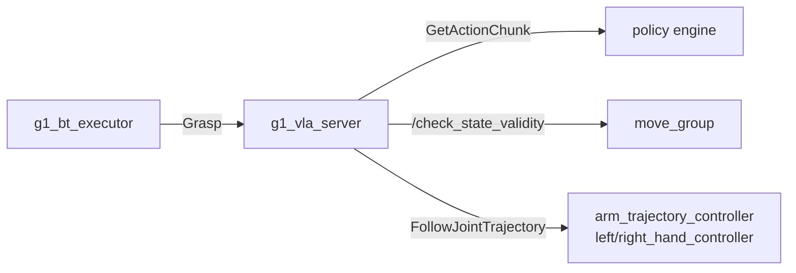

# g1_vla

The learned-grasp skill. A policy engine returns chunks of joint targets; `g1_vla_server`
validates each chunk against the MoveIt planning scene and only then hands it to the trajectory
controllers. Adds no command path: the chunks go out through the controllers MoveIt already
drives.



```bash
colcon build --symlink-install --packages-select g1_vla
```

## Nodes

| Node | Does |
|---|---|
| `g1_vla_server` | Serves `Grasp`. Queries the engine, validates, executes, and measures the lift. |
| `g1_vla_mock_engine` | A stand-in engine that walks named joints toward a fixed target. No model needed. |
| `g1_vla_groot_adapter` | An engine backed by a vision-language-action model served over ZMQ. |

`g1_vla_groot_adapter` is the one Python node here. It is a request-response translator on a
slow path with no timing or safety role, and its whole job is marshalling dictionaries and arrays
against a schema discovered at runtime. It speaks the policy server's wire protocol directly
rather than importing that server's package, which keeps this container free of the model's
dependency tree. Everything with a timing or safety role is C++.

## Interfaces

| Direction | Name | Type |
|---|---|---|
| Action server | `~/grasp` | `g1_msgs/action/Grasp` |
| Service client | `engine_service` | `g1_msgs/srv/GetActionChunk` |
| Service client | `/check_state_validity` | `moveit_msgs/srv/GetStateValidity` |
| Service client | `/get_planning_scene`, `/apply_planning_scene` | `moveit_msgs/srv` |
| Action client | `/{arm_trajectory,left_hand,right_hand}_controller/follow_joint_trajectory` | `control_msgs/action/FollowJointTrajectory` |
| Subscriber | `/objects` | `vision_msgs/msg/Detection3DArray` |
| Subscriber | `/joint_states` | `sensor_msgs/msg/JointState` |
| Service server (engine) | `~/get_action_chunk` | `g1_msgs/srv/GetActionChunk` |

A chunk carries absolute joint positions, may name any subset of the 14 arm and 14 hand joints,
and its `time_from_start` must increase. Every engine serves the same service, so which one runs
is the `engine` launch argument.

## Parameters

`config/g1_vla_server.yaml`:

| Parameter | Default | Meaning |
|---|---|---|
| `engine_timeout_s` | 10.0 | How long one chunk request may take |
| `max_start_jump_rad` | 0.15 | Largest gap allowed between the measured pose and a chunk's first waypoint |
| `max_segment_step_rad` | 0.20 | Largest move allowed between consecutive waypoints |
| `velocity_scaling` | 0.5 | Fraction of each joint's planning velocity limit a chunk may ask for |
| `max_rejected_chunks` | 5 | Consecutive rejections before the goal aborts |
| `timeout_s` | 90.0 | Overall goal deadline |
| `chunk_exec_timeout_s` | 10.0 | Per-controller deadline for one chunk |
| `success_lift_m` | 0.05 | Rise in the object's height that counts as a grasp |
| `object_timeout_ms` | 1000.0 | How stale an `/objects` pose may be |
| `servo_topic` | `/servo_node/delta_joint_cmds` | Where jog commands go in servo mode |
| `servo_publish_rate` | 50.0 | Jog commands per second while streaming a chunk |

These are re-read at the start of every goal, so changing one with `ros2 param set` takes effect
on the next grasp rather than needing a restart.

`engine_service` and `execution_mode` are launch arguments and are deliberately absent from that
file: a key set there under this node's name would beat the launch's own override, which ROS
writes under the `/**` wildcard, because node-specific always wins over a wildcard.

`config/g1_vla_mock_engine.yaml`: `joint_names`, `target_positions`, `steps_per_chunk`,
`action_dt_s`, `step_rad`.

The server reads velocity limits from `robot_description_planning.joint_limits`, which the launch
supplies from `g1_moveit_config`. It logs the resolved arm limit at startup.

## Execution modes

`execution_mode` is a launch argument, not a config key. `trajectory` sends each validated chunk
to the controllers as a `FollowJointTrajectory` goal and waits. `servo` streams the arm's share
as jog commands into a running `servo_node` instead, which adds proximity-based slowdown while
the arm is moving; the hands keep the trajectory path either way, since they are outside servo's
group. Validation is identical in both, and a refused chunk is never streamed.

Servo mode needs `servo_node` running, which `g1_bringup` starts with
`vla_execution_mode:=servo`.

The two modes differ in what they guarantee about the path. Trajectory mode executes the
validated waypoints. Servo mode steers toward them: jog commands are integrated by the servo,
which tracks velocity rather than position, so the arm can end up a little off the checked path.
Servo's own collision monitor covers that, decelerating and halting on proximity while the arm is
moving. Prefer trajectory mode unless that reaction is what you want.

## Failure behaviour

A rejected chunk is not executed at all, so the robot has not moved; the server asks the engine
again. After `max_rejected_chunks` in a row the goal aborts with a message starting `blocked:`.
Any failure leaves the arm and hand where they are and restores the collision exemption. Moving
away afterwards is the behavior tree's job.

## Running

The server needs `move_group`, the controllers, and an acquired arm, all of which `g1_bringup`
composes. Standalone, against the mock engine:

```bash
ros2 launch g1_vla vla.launch.py engine:=mock
```

Against a real policy, with the model server already running outside the container:

```bash
ros2 launch g1_vla vla.launch.py engine:=groot
```

The model's modality keys belong to its checkpoint, so `config/g1_vla_groot_adapter.yaml` maps
them to joint names rather than assuming them. Start the adapter once against the server: it logs
every key the server reports and refuses to serve until each one is mapped.

## Tests

| Test | Covers |
|---|---|
| `test_chunk_utils` | Chunk shape, the start-jump, segment-step and velocity checks, and the controller split |
| `test_groot_adapter` | The adapter against a stub policy server: wire protocol, key mapping, and action integration. No simulator or GPU. |
| `test_vla_grasp_mock` | Sim, `-L simulator`. Valid chunks reach the controllers and move the arm; a chunk aimed at a colliding pose is refused with the arm still where it started. |
| `test_vla_grasp_servo` | Sim, `-L simulator`. The same two claims under the servo backend, plus servo halting for a collision while the arm is already moving. |
