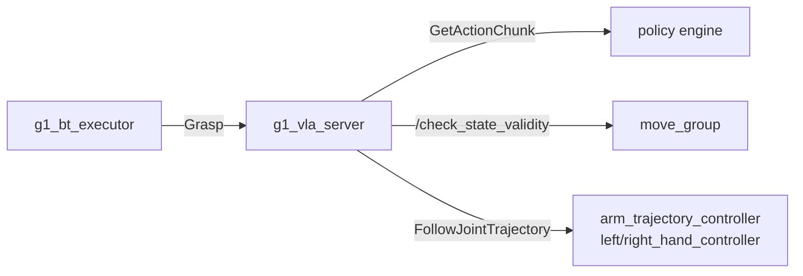

# g1_vla

The learned-grasp skill. A policy engine returns chunks of joint targets; `g1_vla_server`
validates each chunk against the MoveIt planning scene and only then hands it to the trajectory
controllers MoveIt already drives, so the skill adds no command path of its own. It takes no
control authority either: the arm and hands must already be acquired.



```bash
colcon build --symlink-install --packages-select g1_vla
```

## Nodes

| Node | Does |
|---|---|
| `g1_vla_server` | Serves `Grasp`. Queries the engine, validates each chunk, executes it, and measures the lift. |
| `g1_vla_mock_engine` | Stand-in engine that walks named joints toward a fixed target. No model needed. |
| `g1_vla_groot_adapter` | Engine backed by a GR00T policy server over ZMQ. |

`g1_vla_groot_adapter` is Python because it only marshals dictionaries and arrays against a
schema read at runtime, on a slow path with no timing or safety role. It speaks the policy
server's wire protocol directly, so the container never needs the model's dependencies.

`vla.launch.py` starts the server and the engine chosen by `engine:=mock|groot`, and
`execution_mode:=trajectory|servo`. It needs `move_group` and the controllers already running.

## Interfaces

| Direction | Name | Type |
|---|---|---|
| Action server | `~/grasp` | `g1_msgs/action/Grasp` |
| Service client | `engine_service` | `g1_msgs/srv/GetActionChunk` |
| Service client | `/check_state_validity` | `moveit_msgs/srv/GetStateValidity` |
| Service client | `/get_planning_scene`, `/apply_planning_scene` | `moveit_msgs/srv` |
| Action client | `/{arm_trajectory,left_hand,right_hand}_controller/follow_joint_trajectory` | `control_msgs/action/FollowJointTrajectory` |
| Publisher (servo mode) | `servo_topic` | `control_msgs/msg/JointJog` |
| Service client (servo mode) | `/servo_node/switch_command_type` | `moveit_msgs/srv/ServoCommandType` |
| Subscriber | `/objects` | `vision_msgs/msg/Detection3DArray` |
| Subscriber | `/joint_states` | `sensor_msgs/msg/JointState` |
| Service server (engines) | `~/get_action_chunk` | `g1_msgs/srv/GetActionChunk` |

The GR00T adapter also reads `/joint_states`, the image topics in `video_topics` (sensor QoS),
and TF for the wrist poses.

A chunk carries absolute joint positions for any subset of the 14 arm and 14 hand joints, and its
`time_from_start` must increase.

## Parameters

`config/g1_vla_server.yaml`:

| Parameter | Default | Meaning |
|---|---|---|
| `engine_timeout_s` | 10.0 | How long one chunk request may take |
| `max_start_jump_rad` | 0.15 | Largest gap allowed between the measured pose and a chunk's first waypoint |
| `max_segment_step_rad` | 0.20 | Largest move allowed between consecutive waypoints |
| `velocity_scaling` | 0.8 | Fraction of each joint's velocity limit a chunk may ask for |
| `replan_period_s` | 0.15 | Minimum time between chunks sent in trajectory mode |
| `max_rejected_chunks` | 5 | Consecutive rejections before the goal aborts |
| `timeout_s` | 90.0 | Overall goal deadline |
| `chunk_exec_timeout_s` | 10.0 | Per-controller deadline for one chunk |
| `success_lift_m` | 0.05 | Rise in the object's height that counts as a grasp |
| `object_timeout_ms` | 1000.0 | How stale an `/objects` pose may be |
| `servo_topic` | `/servo_node/delta_joint_cmds` | Where jog commands go in servo mode |
| `servo_publish_rate` | 50.0 | Jog commands per second while streaming a chunk |

All but `servo_topic` are re-read at the start of every goal, so `ros2 param set` takes effect on
the next grasp. `engine_service` and `execution_mode` are set by the launch file and kept out of
the yaml, because a key under the node's name there would override the launch's `/**` value.

Velocity limits come from `robot_description_planning.joint_limits`, which `vla.launch.py` loads
from this package's `config/joint_limits.yaml`: MoveIt's limits with the arms at 1.0 rad/s
instead of 0.8, since a chunk is timed at its training rate. Planned motions keep MoveIt's own
limits. The server logs the resolved arm limit at startup.

`config/g1_vla_mock_engine.yaml`: `joint_names`, `target_positions` (read per request, so a test
can retarget it live), `steps_per_chunk`, `action_dt_s`, `step_rad`.

`config/g1_vla_groot_adapter.yaml`:

| Parameter | Default | Meaning |
|---|---|---|
| `server_address` | `tcp://127.0.0.1:5555` | The policy server on the host |
| `zmq_timeout_ms` | 8000 | Per request |
| `action_dt_s` | 0.125 | Minimum waypoint spacing, s |
| `max_horizon` | 8 | Waypoints kept from each prediction |
| `max_joint_speed` | 0.7 | rad/s; slower segments keep `action_dt_s`, faster ones are stretched |
| `max_image_age_s` | 5.0 | Oldest camera frame accepted |
| `action_mode` | `absolute` | `relative_to_observation` only for a server that returns deltas |
| `history_step_s` | 0.0333 | Wall time per step of frame history |
| `state_joints`, `state_eef_frames`, `action_joints`, `video_topics` | | Map the checkpoint's modality keys to joints, TF frames and image topics |

## Execution modes

`execution_mode` is a launch argument. `trajectory` sends each validated chunk as a
`FollowJointTrajectory` goal without waiting, so the next validated chunk replaces it mid-motion.
`servo` streams the arm's share as jog commands into a running `servo_node` (`g1_bringup` starts
one with `vla_execution_mode:=servo`) and adds proximity slowdown while the arm moves; the hands
stay on the trajectory path. Validation is identical, and a refused chunk is never streamed.

Servo tracks velocity, not position, so the arm can end up slightly off the validated path; its
own collision monitor covers that by halting on proximity. Prefer trajectory mode unless that
reaction is what you want.

## Failure behaviour

A rejected chunk never reaches a controller, and the trajectory still running is cancelled, so
the arm stops where it is; the server then asks the engine again. `max_rejected_chunks` in a row
aborts the goal with a message starting `blocked:`. Every exit cancels motion and restores the
hand's collision exemption. Moving away afterwards is the behavior tree's job.

## Running in simulation

```bash
ros2 launch g1_bringup bringup.launch.py world:=manipulation pin_pelvis:=true \
    odometry:=ground_truth moveit:=true manipulation:=true vla:=true vla_engine:=mock \
    activate_arm:=true activate_arm_delay_s:=40.0
ros2 action send_goal /g1_vla_server/grasp g1_msgs/action/Grasp \
    "{instruction: 'pick up the red block', object_id: red_block, arm: right}"
```

The mock engine never grasps, so that goal ends on its timeout; it exists to exercise the gate.
For a real policy, run `scripts/groot_server.py` on the host (set up by `scripts/setup-groot.sh`)
and use `vla_engine:=groot`. The model's modality keys belong to its checkpoint, so the adapter
logs every key the server reports and refuses to serve until every state and video key is mapped.

## Tests

| Test | Covers |
|---|---|
| `test_chunk_utils` | Chunk shape, the start-jump, segment-step and velocity checks, and the controller split |
| `test_groot_adapter` | The adapter against a stub policy server: wire protocol, key mapping, and action integration. No simulator or GPU. |
| `test_vla_grasp_mock` | Sim, `-L simulator`. Valid chunks reach the controllers and move the arm; a chunk aimed at a colliding pose is refused with the arm still where it started. |
| `test_vla_grasp_servo` | Sim, `-L simulator`. The same two claims under the servo backend, plus servo halting for a collision while the arm is already moving. |
