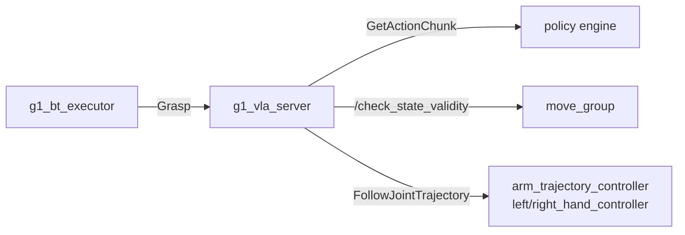

# g1_vla

The learned-grasp skill. A policy engine returns chunks of joint targets; `g1_vla_server`
validates each chunk against the MoveIt planning scene and only then hands it to the trajectory
controllers. Adds no command path: the chunks go out through the controllers MoveIt already
drives.



```bash
colcon build --symlink-install --packages-select g1_vla
```

## Nodes

| Node | Does |
|---|---|
| `g1_vla_server` | Serves `Grasp`. Queries the engine, validates, executes, and measures the lift. |
| `g1_vla_mock_engine` | A stand-in engine that walks named joints toward a fixed target. No model needed. |

## Interfaces

| Direction | Name | Type |
|---|---|---|
| Action server | `~/grasp` | `g1_msgs/action/Grasp` |
| Service client | `engine_service` | `g1_msgs/srv/GetActionChunk` |
| Service client | `/check_state_validity` | `moveit_msgs/srv/GetStateValidity` |
| Service client | `/get_planning_scene`, `/apply_planning_scene` | `moveit_msgs/srv` |
| Action client | `/{arm_trajectory,left_hand,right_hand}_controller/follow_joint_trajectory` | `control_msgs/action/FollowJointTrajectory` |
| Subscriber | `/objects` | `vision_msgs/msg/Detection3DArray` |
| Subscriber | `/joint_states` | `sensor_msgs/msg/JointState` |
| Service server (engine) | `~/get_action_chunk` | `g1_msgs/srv/GetActionChunk` |

A chunk carries absolute joint positions, may name any subset of the 14 arm and 14 hand joints,
and its `time_from_start` must increase. Every engine serves the same service, so which one runs
is the `engine` launch argument.

## Parameters

`config/g1_vla_server.yaml`:

| Parameter | Default | Meaning |
|---|---|---|
| `engine_service` | `/g1_vla_engine/get_action_chunk` | Where the chunks come from |
| `engine_timeout_s` | 10.0 | How long one chunk request may take |
| `max_start_jump_rad` | 0.15 | Largest gap allowed between the measured pose and a chunk's first waypoint |
| `max_segment_step_rad` | 0.20 | Largest move allowed between consecutive waypoints |
| `velocity_scaling` | 0.5 | Fraction of each joint's planning velocity limit a chunk may ask for |
| `max_rejected_chunks` | 5 | Consecutive rejections before the goal aborts |
| `timeout_s` | 90.0 | Overall goal deadline |
| `chunk_exec_timeout_s` | 10.0 | Per-controller deadline for one chunk |
| `success_lift_m` | 0.05 | Rise in the object's height that counts as a grasp |
| `object_timeout_ms` | 1000.0 | How stale an `/objects` pose may be |

`config/g1_vla_mock_engine.yaml`: `joint_names`, `target_positions`, `steps_per_chunk`,
`action_dt_s`, `step_rad`.

The server reads velocity limits from `robot_description_planning.joint_limits`, which the launch
supplies from `g1_moveit_config`. It logs the resolved arm limit at startup.

## Failure behaviour

A rejected chunk is not executed at all, so the robot has not moved; the server asks the engine
again. After `max_rejected_chunks` in a row the goal aborts with a message starting `blocked:`.
Any failure leaves the arm and hand where they are and restores the collision exemption. Moving
away afterwards is the behavior tree's job.

## Running

The server needs `move_group`, the controllers, and an acquired arm, all of which `g1_bringup`
composes. Standalone, against the mock engine:

```bash
ros2 launch g1_vla vla.launch.py engine:=mock
```

## Tests

| Test | Covers |
|---|---|
| `test_chunk_utils` | Chunk shape, the start-jump, segment-step and velocity checks, and the controller split |
